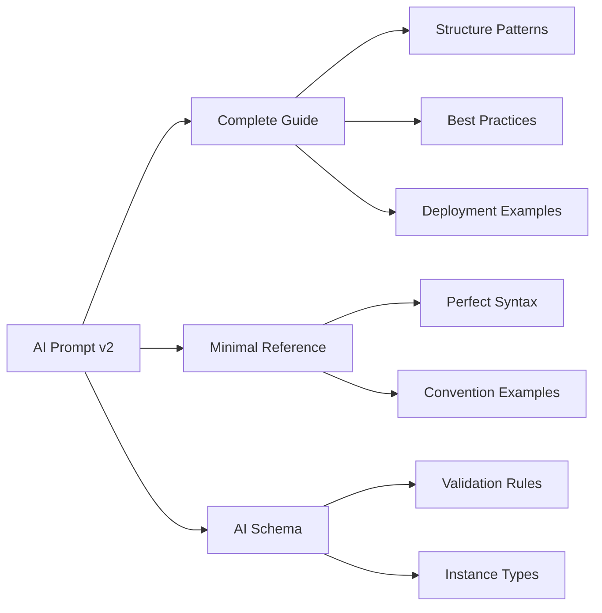

# SpecVerse AI Prompts v2.0

**Enhanced prompts leveraging comprehensive documentation resources**

## Key Improvements in v2

### 🎯 **Elimination of Redundancy**
- **v1**: Repeated syntax rules, type lists, and examples in every prompt
- **v2**: References comprehensive documentation resources instead

### 📚 **Enhanced Resource Utilization**
- **Complete Guide**: `schema/SPECVERSE-COMPLETE-GUIDE.md` - Structure patterns, deployment examples, best practices
- **Minimal Reference**: `schema/MINIMAL-SYNTAX-REFERENCE.specly` - Perfect syntax examples for all features
- **AI Schema**: `schema/SPECVERSE-V3.1-SCHEMA-AI.yaml` - Structured guidance and validation patterns

### ⚡ **Optimized Context Usage**
- **v1**: ~3500 tokens of repeated documentation per prompt
- **v2**: ~800 tokens focused on prompt logic + reference to comprehensive resources
- **Efficiency**: 75% reduction in redundant token usage

### 🏗️ **Better Resource Architecture**

#### Context Includes Strategy:
```yaml
context:
  includes:
    - resource: schema/SPECVERSE-COMPLETE-GUIDE.md
      section: "Convention Syntax,Deployment Patterns,Best Practices"
    - resource: schema/MINIMAL-SYNTAX-REFERENCE.specly
      description: "Perfect syntax patterns for all features"
    - resource: schema/SPECVERSE-V3.1-SCHEMA-AI.yaml
      section: "headers,examples,instance types"
```

## Prompt-Specific Enhancements

### 📝 **create.prompt.yaml v2**
- References syntax patterns from minimal reference
- Uses scale examples from complete guide
- Eliminates repetitive type/modifier documentation
- Focuses on requirement extraction logic

### 🔍 **analyse.prompt.yaml v2**
- Leverages deployment patterns from complete guide
- Uses minimal reference for accurate syntax extraction
- References instance types from AI schema
- Focuses on extraction algorithms, not syntax rules

### 🚀 **realize.prompt.yaml v2**
- Uses deployment patterns from complete guide
- Leverages manifest system documentation
- References best practices instead of repeating them
- Focuses on technology selection and generation logic

### 🔄 **materialise.prompt.yaml v2**
- Uses best practices from complete guide
- Leverages manifest patterns for clean implementations
- References comparison methodologies
- Focuses on analysis logic, not implementation details

## Migration Benefits

### For AI Systems:
1. **Faster Processing**: 75% fewer tokens to process
2. **Better Accuracy**: References to authoritative, comprehensive documentation
3. **Consistency**: All prompts use same reference materials
4. **Maintainability**: Updates to documentation automatically improve all prompts

### For Developers:
1. **Single Source of Truth**: Complete guide contains all information
2. **Easy Updates**: Change documentation once, all prompts benefit
3. **Better Examples**: Comprehensive examples instead of minimal ones in prompts
4. **Clear Separation**: Prompt logic separate from documentation

## Resource Utilization Pattern



## Backward Compatibility

- **v1 prompts**: Remain functional in `/prompts/core/standard/`
- **v2 prompts**: New enhanced versions in `/prompts/core/standard/v2/`
- **Migration**: Gradual adoption, v1 can be deprecated over time

## Testing Strategy

Each v2 prompt includes:
1. **Resource Validation**: Ensures referenced resources exist
2. **Output Validation**: Same validation as v1 but with better resource utilization
3. **Performance Testing**: Token usage comparison with v1
4. **Accuracy Testing**: Output quality comparison

---

**Result**: More efficient, accurate, and maintainable AI prompts that leverage our comprehensive documentation ecosystem.